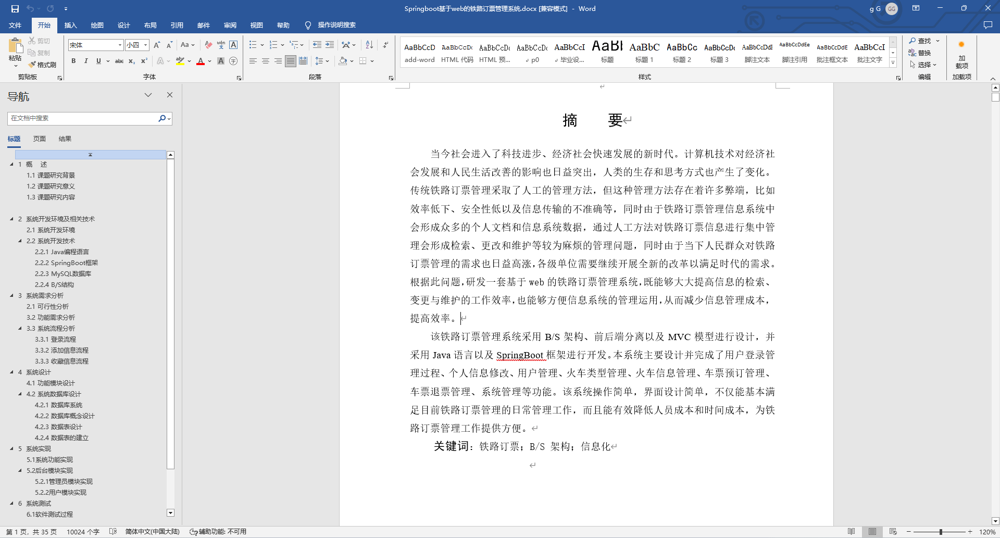
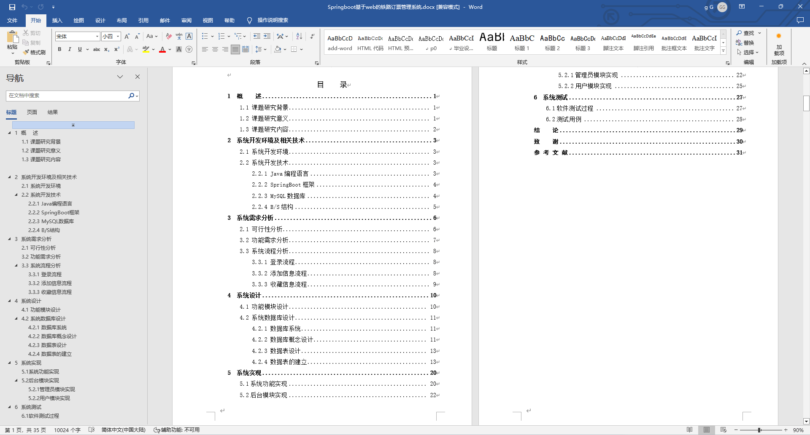
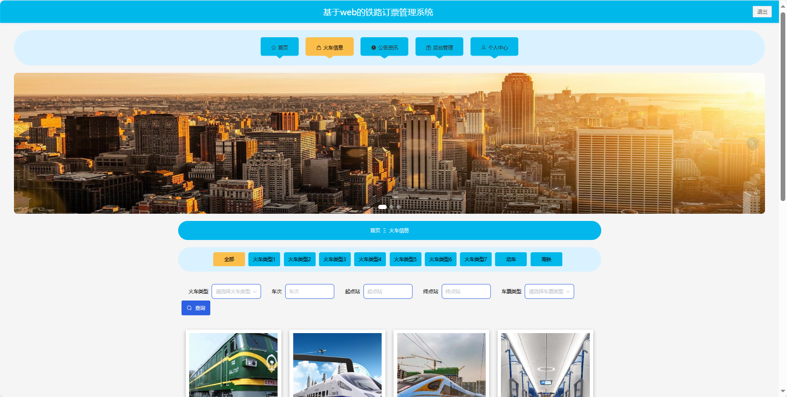
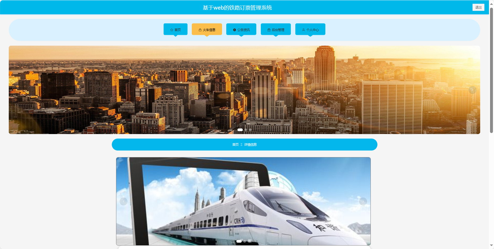
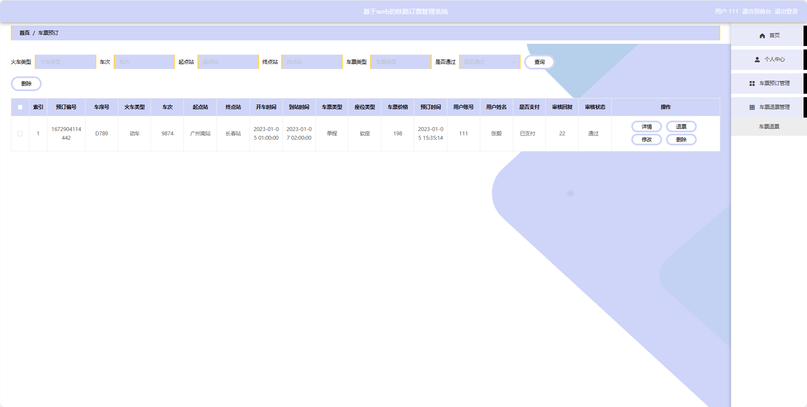

基于Springboot的铁路订票管理系统（程序+论文）
=
### 完整代码获取地址：从戎源码网 ([https://armycodes.com/](https://armycodes.com/))
### 作者微信：19941326836  QQ：952045282 
### 承接计算机毕业设计、Java毕业设计、Python毕业设计、深度学习、机器学习
### 选题+开题报告+任务书+程序定制+安装调试+论文+答辩ppt 一条龙服务
### 所有选题地址https://github.com/nature924/allProject

一、项目介绍
---
基于Spring Boot框架实现的铁路订票管理系统，系统包含两种角色：管理员、用户主要功能如下。
### 【用户功能】

首页：浏览铁路订票管理系统的主要信息。
火车信息：查看火车的相关信息，包括车次、出发地、目的地和票价等。
公告资讯：阅读系统发布的相关通知和资讯。
后台管理：进行系统首页、个人中心、车票预订管理、车票退票管理等操作。
个人中心：管理个人信息，查看订单历史记录等。

### 【管理员功能】

首页：查看铁路订票管理系统。
个人中心：修改密码、管理个人信息。
用户管理：审核和管理注册用户的信息。
火车类型管理：管理系统中的火车类型信息。
火车信息管理：监管和管理系统中的火车信息，添加、编辑、删除等。
车票预订管理：处理用户的车票预订请求。
车票退票管理：处理用户的车票退票请求。
系统管理：管理系统的基本设置，公告资讯、关于我们、系统简介和轮播图管理。

二、项目技术
---
- 编程语言：Java
- 数据库：MySQL
- 项目管理工具：Maven
- 前端技术：VUE、HTML、Jquery、Bootstrap
- 后端技术：Spring、SpringMVC、MyBatis

三、运行环境
---
- 操作系统：Windows、macOS都可以
- JDK版本：JDK1.8以上都可以
- 开发工具：IDEA、Ecplise、Myecplise都可以
- 数据库: MySQL5.7以上都可以
- Tomcat：任意版本都可以
- Maven：任意版本都可以

四、运行截图
---
### 论文截图：

### 程序截图：

